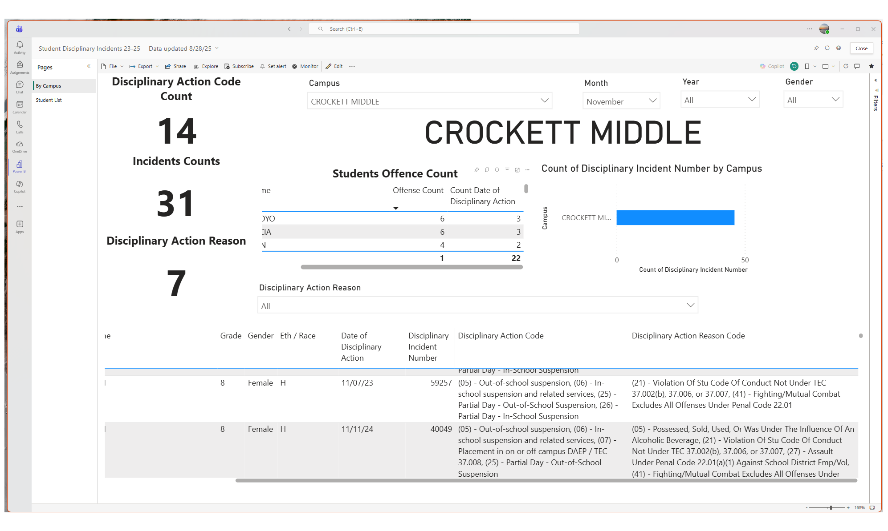
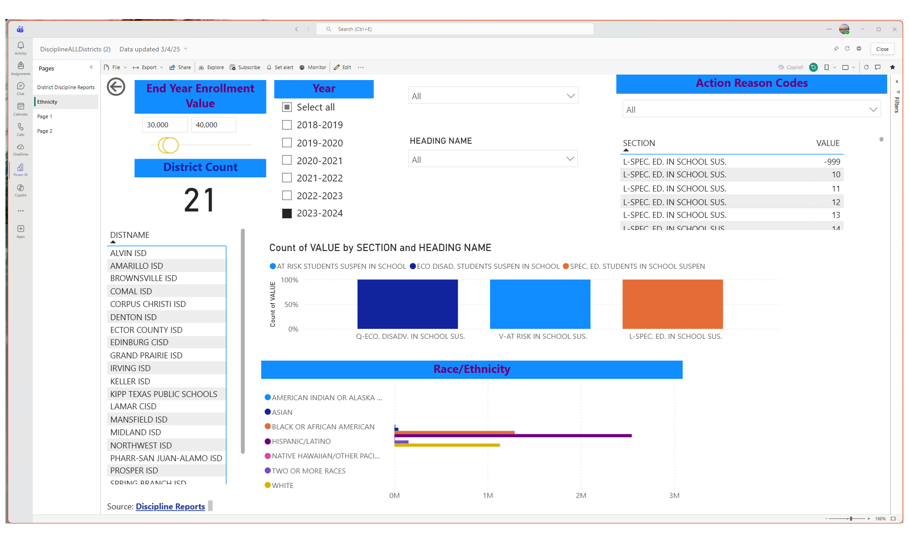
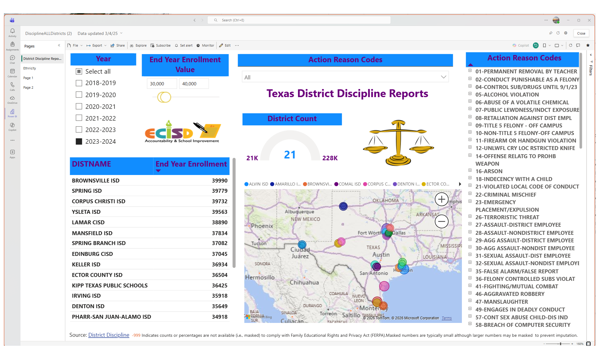

# Texas Discipline Analytics Dashboard

Interactive Power BI dashboards built using publicly available Texas discipline reporting data.

## Overview

This project demonstrates how public education data can be transformed into actionable insights through data modeling, visualization, and reporting.

The dashboards support:

* District comparisons
* Discipline trend analysis
* Student group analysis
* Statewide benchmarking
* Data-driven decision making

## Dashboard Gallery

### District Comparison

### Discipline Trends

### Ethnicity Analysis

### Statewide Dashboard

## Technologies

* Power BI
* Power Query
* DAX
* Excel
* Texas Public Education Data

## Data Sources

See data/source_links.md

## Privacy

This project uses publicly available aggregate data only.

No student-level information is included.
